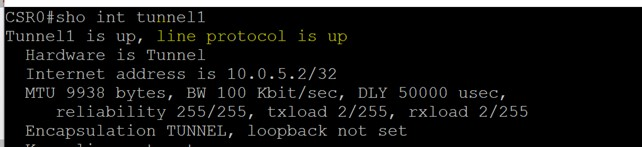

# **Azure VPN Gateway with NAT rules – MicroHack**

Table of contents

 [Introduction](#introduction)

 [Challenge 1: Build VPN tunnel and apply Static NAT rules](#challenge-1-build-vpn-tunnel-and-apply-static-nat-rules)

 [Challenge 2: Convert to Dynamic NAT rules to the connection](#challenge-2-convert-to-dynamic-nat-rules-to-the-connection)

 [Challenge 3: NAT rules impact on BGP advertisements](#challenge-3-nat-rules-impact-on-bgp-advertisements)

# **Introduction**

Azure VPN NAT (Network Address Translation) supports overlapping address spaces between customers on-premises branch networks and their Azure Virtual Networks. NAT can also enable business-to-business connectivity where address spaces are managed by different organizations and re-numbering networks is not possible.

In this MicroHack we will explore the Azure VPN NAT features in its most common scenario, so when Azure VNET address ranges overlap with onprem-connected network segments.

We will cover the differences between Static and Dynamic NAT modes with relevant benefits, limitations and impact on routing.

# **Challenge 1: Build VPN tunnel and apply Static NAT rules**

In this first part, we will build a basic environment composed as per the following diagram:


A first VNET will emulate an onprem branch to be connected to Azure side.

A second VNET will be the real Azure environment, hosting our VPN Gateway solution with NAT rules.

We will build an IPSEC tunnel between the environments, with BGP enabled, we will configure **Static** NAT rules on our VPN Gateway, and we will create a successful communication between 2 VMs with same private IP over the tunnel.

The Azure-side traffic will be seen by onprem as originated from network range 100.0.1.0/24

The Onprem-side traffic will be seen by Azure as originated from network range 100.0.2.0/24

**TASK 1 – Create the basic environment**

To create the basic environment, please follow these instructions.

-Log in to Azure Cloud Shell at https://shell.azure.com/ and select Bash

-Ensure Azure CLI and extensions are up to date:

```
az upgrade --yes
```
-If necessary select your target subscription:

```
az account set --subscription <Name or ID of subscription>
```

-Clone the GitHub repository:

```
git clone https://github.com/Danieleg82/AzureVPN-NAT
```

-Change directory:

```
cd ./AzureVPN-NAT/Main
```

-Initialize terraform and download the azurerm resource provider:

```
terraform init
```

-Now start the deployment (when prompted, confirm with yes to start the deployment):

```
terraform apply
```

This will take around 20 minutes to complete to accommodate the time to deploy VNET Gateway

As soon as it's completed, you will be in the following conditions:

- An Azure VNET with a VNET-Gateway installed but not configured with any connection or NAT rule
- An Onprem site (emulated with a VNET with overlapping IP space) with a Cisco CSR router deployed but not configured
- 2 VMs deployed – 1 in Azure 1 Onprem – sharing same IP address
- NSGs deployed to core subnets on both sides, and already pre-configured with the needed security rules for granting final connectivity purposes

_Note:_ For accessing the CSR and the VMs you will need to configure JIT access at VM level (the VMs have a public IP mapped, the JIT request will provide accessibility over SSH to the deployments)

Any VM in this lab will have the following access credentials configured:

```
    admin_username = AdminUser
    admin_password = MyVPNGWNAT_Lab!
```

Next steps after deployment will be to

1. Program VPN Gateway with relevant Connection object and Static NAT rules
2. Program CSR router and UDRs at Onprem side to drive NATted traffic from Azure toward CSR itself
3. Test the connectivity between AzureVM and OnpremVM

**TASK 2 – Configure Gateway Connection and NAT rules**

As first step we need to proceed with the creation of a **LocalNetworkGateway** representing our BGP-enabled Onprem segment, a **Connection** object and the **Static NAT rules** we want to apply.

_LNG_

```Powershell

$RG = "VPNGWNATRG"
$Location = "West Europe"
$GWName = "AzureGW"
$CSRPublicIP = Get-AzPublicIpAddress -Name CSRVIP -ResourceGroupName $RG
$LNG = New-AzLocalNetworkGateway -Name OnpremLNG -ResourceGroupName $RG -Location $Location -GatewayIpAddress $CSRPublicIP.ipAddress -BgpPeeringAddress '192.168.1.1' -Asn 65001

```

_NAT rules_

```Powershell
$VPNGW = Get-AzVirtualNetworkGateway -Name $GWName -ResourceGroupName $RG
$egressnatrule = New-AzVirtualNetworkGatewayNatRule -Name "EgressRule" -Type "Static" -Mode "EgressSnat" -InternalMapping @("10.0.1.0/24") -ExternalMapping @("100.0.1.0/24")
$ingressnatrule = New-AzVirtualNetworkGatewayNatRule -Name "IngressRule" -Type "Static" -Mode "IngressSnat" -InternalMapping @("10.0.1.0/24") -ExternalMapping @(";100.0.2.0/24")
Set-AzVirtualNetworkGateway -VirtualNetworkGateway $VPNGW -NatRule $ingressnatrule,$egressnatrule -BgpRouteTranslationForNat $true

```

_Connection_

```Powershell
New-AzVirtualNetworkGatewayConnection -Name Connection -ResourceGroupName $RG -Location $Location -VirtualNetworkGateway1 $VPNGW -LocalNetworkGateway2 $LNG -ConnectionType IPsec -EnableBgp $true -ConnectionProtocol IKEv2 -SharedKey 'MyVPNConnection1!' -IngressNatRule $ingressnatrule -EgressNatRule $egressnatrule
```

**TASK 3 – Configure Cisco and UDRs**

Acquire JIT access to your Cisco CSR deployment – if needed – or create dedicated security rules in the NSG bound to the external subnet of the CSR (CSRExternalSubnet) to grant SSH connectivity from your public IP.

SSH to the CSR

Go to command prompt and type:

```
ssh AdminUser@CSRPublicIP
```

Once connected to the CSR, enter config mode:

```
Conf t
```

Apply the following configuration script, paste in below configuration one block at a time, make sure to replace _VPNGWPublicIP_ with the IP of your VPN gateway:

```
crypto ikev2 proposal Azure-Ikev2-Proposal
encryption aes-cbc-256
integrity sha1 sha256
group 2
!
crypto ikev2 policy Azure-Ikev2-Policy
match address local 10.0.3.4
proposal Azure-Ikev2-Proposal
!
crypto ikev2 keyring to-onprem-keyring
peer <VPNGWPublicIP>
address <VPNGWPublicIP>
pre-shared-key MyVPNConnection1!
!
crypto ikev2 profile Azure-Ikev2-Profile
match address local 10.0.3.4
match identity remote address <VPNGWPublicIP>
authentication remote pre-share
authentication local pre-share
keyring local to-onprem-keyring
lifetime 28800
dpd 10 5 on-demand
!
crypto ipsec transform-set to-Azure-TransformSet esp-gcm 256
mode tunnel
!
crypto ipsec profile to-Azure-IPsecProfile
set transform-set to-Azure-TransformSet
set ikev2-profile Azure-Ikev2-Profile
!
interface Loopback1
ip address 192.168.1.1 255.255.255.255
!
interface Tunnel1
ip address 10.0.3.10 255.255.255.255
ip tcp adjust-mss 1350
tunnel source 10.0.3.4
tunnel mode ipsec ipv4
tunnel destination <VPNGWPublicIP>
tunnel protection ipsec profile to-Azure-IPsecProfile
!
router bgp 65001
bgp router-id 192.168.1.1
bgp log-neighbor-changes
neighbor 10.0.2.254 remote-as 65600
neighbor 10.0.2.254 ebgp-multihop 255
neighbor 10.0.2.254 update-source Loopback1
!
address-family ipv4
neighbor 10.0.2.254 activate
network 10.0.1.0 mask 255.255.255.0
exit-address-family
!
!Static route to Azure BGP peer IP
ip route 10.0.2.254 255.255.255.255 Tunnel1
!Static route to internal workload subnet
ip route 10.0.1.0 255.255.255.0 10.0.10.1
```

Type "Exit" or "End" or simply hit CTRL+Z to exit configurator, then type

```
W
```

Validate the status of the IKEv2 tunnel:

```
Show crypto ikev2 sa
```


Validate status of the IPSEC security associations

```
Show crypto ipsec sa
```


Validate Tunnel interface status in general

```
Show int Tunnel1
```



Now validate the status of BGP peering between VNET Gateway and CSR:

```
Show ip bgp summary
```


```
Show ip bgp
```


Note the routes CSR is receiving from VNET Gateway:

Gateway is advertising 2 routes: a generic 10.0.0.0/16 one and the specific one related with our EgressNAT range (100.0.1.0/24)

An integration with **Azure Route Server** in our emulated onprem environment would allow to avoid any static route configuration on that side, but this is out of scope here, so in order to create appropriate routing from the Onprem VM back to Azure we need to configure a UDR mapped to Onprem VM subnet:

```Powershell
$RG = "VPNGWNATRG"
$Location = "West Europe"
$OnpremRT = New-AzRouteTable -Name 'OnpremRT' -ResourceGroupName $RG -location $Location
Get-AzRouteTable -ResourceGroupName $RG -Name 'OnpremRT'| Add-AzRouteConfig -Name "ToAzure" -AddressPrefix 100.0.0.0/16 -NextHopType "VirtualAppliance" -NextHopIpAddress 10.0.10.4 | Set-AzRouteTable
Get-AzVirtualNetwork -Name 'OnpremVNET' -ResourceGroupName $RG | Set-azvirtualnetworksubnetConfig -Name 'Subnet1' -AddressPrefix 10.0.1.0/24 -RouteTable $OnpremRT | set-AzVirtualNetwork
```

Now check the IPSEC &amp; BGP connectivity status from VPN Gateway side:


Note how VPN Gateway is ignoring the route received from CSR since it's already covered by its own internal network-rule for the NATted range 100.0.2.0/24

Any IP range advertised by a remote branch which is overlapping with IngressNAT rules&#39; InternalMapping will be dropped by GW, which will leverage static Network routes configured via NAT.

Any advertised range which is NOT overlapping with the NAT rules definitions, will be installed as it is.

**IMPORTANT NOTE:** the NAT concept cannot be applied to the Azure VNET Gateway subnet itself or to the BGP peer IP

[https://docs.microsoft.com/en-us/azure/vpn-gateway/nat-overview#routing](https://docs.microsoft.com/en-us/azure/vpn-gateway/nat-overview#routing)

BGP peer IP address consideration for a NAT&#39;ed on-premises network:

- APIPA (169.254.0.1 to 169.254.255.254) address: NAT is not supported with BGP APIPA addresses.
- Non-APIPA address: Exclude the BGP Peer IP addresses from the NAT range.

**TASK 4 – Test VMs connectivity**

Connect to both _AzureVM_ and _OnpremVM_ via SSH after a JIT request or NSG configuration.

From AzureVM side, run:

```
Ping 100.0.2.4
```


From OnpremVM side, run:

```
Sudo tcpdump icmp -n
```

**Question:** What's the source IP generating ICMP requests seen by OnpremVM?

Now ping in the opposite direction, and check again which source IP is seen to generate traffic.

# **Challenge 2: Convert to Dynamic NAT rules to the connection**

When using Dynamic NAT rules, an IP address can be translated to different target IP addresses and TCP/UDP port based on availability, or with a different combination of IP address and TCP/UDP port. The latter is also called NAPT, Network Address and Port Translation.

Dynamic rules will result in stateful translation mappings depending on the traffic flows at any given time. Due to the nature of Dynamic NAT and the ever changing IP/Port combinations, flows that make use of Dynamic NAT rules have to be initiated from the  **InternalMapping**  (Pre-NAT) IP Range. The dynamic mapping is released once the flow is disconnected or gracefully terminated.

If the target address pool size is the same as the original address pool, use static NAT rule to define a 1:1 mapping in a sequential order. If the target address pool is smaller than the original address pool, use dynamic NAT rule to accommodate the differences.

In this challenge we will modify the VPN NAT rule approach to use Dynamic NAT in the direction from Azure to Onprem (EgressNAT).

When using Dynamic NAT approach, one fundamental thing to be considered is that the connection can be **unidirectional only.**

If Dynamic NAT is applied as EgressNAT, only Azure side will be able to initiate connections toward onprem.

**Task1 – modify NAT rules to Dynamic**

As first step we will disassociate existing EgressNAT rules from our connection:

```Powershell
$RG = "VPNGWNATRG"
$GWName = "AzureGW"
$VPNGW = Get-AzVirtualNetworkGateway -Name $GWName -ResourceGroupName $RG
$connection = Get-AzVirtualNetworkGatewayConnection -Name Connection -ResourceGroupName $RG
$connection.EgressNatRules = $null
Set-AzVirtualNetworkGatewayConnection -VirtualNetworkGatewayConnection $connection -Force
```

The StaticNAT rules will be kept in order to grant connectivity with the remote overlapping range, but the traffic from Azure side will be linked to a single /32 egressing address.

We will now create an Egress Dynamic NAT rule linking traffic from Azure side to a single /32 egressing address, and associate it to our VPN Gateway:

```Powershell
$GWIPconfig= $VPNGW.IpConfigurations.id
$Dynamicegressnatrule = New-AzVirtualNetworkGatewayNatRule -Name "DynamicEgressRule" -Type "Dynamic" -IpConfigurationId $GWIPconfig -Mode "EgressSnat" -InternalMapping @("10.0.1.0/24") -ExternalMapping @("100.0.1.15/32")
Set-AzVirtualNetworkGateway -VirtualNetworkGateway $VPNGW -NatRule $Dynamicegressnatrule -BgpRouteTranslationForNat $true
```

We will finally link the new NAT rule to the existing VPN connection:

```Powershell
$Dynamicegressnatrule = Get-AzVirtualNetworkGatewayNatRule -ResourceGroupName $RG -Name "DynamicEgressRule" -ParentResourceName $GWName
$connection.EgressNatRules = $Dynamicegressnatrule
Set-AzVirtualNetworkGatewayConnection -VirtualNetworkGatewayConnection $connection -Force
```

**Task2 – Test VMs connectivity**

Connect to both _AzureVM_ and _OnpremVM_ via SSH after a JIT request or NSG configuration.

From AzureVM side, run:

```
Ping 100.0.2.4
```


From OnpremVM side, run:

```
Sudo tcpdump icmp -n
```

**Question:** What's the source IP generating ICMP requests seen by OnpremVM?

**Task3 – Test traffic from another source VM**

We will now proceed generating traffic toward same destination (OnpremVM) but from a different Azure resource.

Let's deploy a new Azure linux VM in the same subnet used for AzureVM.

From Cloudshell, enter in the DeployVM module

```
cd ./AzureVPN-NAT/DeployVM
```
Run:

```
Terraform Init
```

and start deployment:

```
Terraform apply
```

Enter YES when prompted.

Wait until completion of new VM deployment.

Configure JIT on the new VM (AzureVM2) and connect to it.


Now run:

```
Ping 100.0.2.4
```

Connect back to OnpremVM (make sure that TCPDUMP is still running on it, and that PING is still running as well from AzureVM)

**Question** : Do we see any ICMP traffic on OnpreVM generated by any host !=100.0.1.15 ?

# **Challenge 3: NAT rules impact on BGP advertisements**

As we've seen in Challenge1, Azure VPN Gateway is basically dropping any routes advertised by remote branch, if overlapping exists between the InternalMapping of the relevant IngressNAT rules and the what is advertised.

Goal of the next challenge will be to evaluate the impact of advertisement of BGP ranges which are not overlapping with NAT rules mappings, and to demonstrate how the whole routing is not impacted by NAT rules associated with a connection, in the case when the connection is used for traffic between non-overlapping resources.

**Task1 – Configuration of the new Onprem address range**

To demonstrate this, we will emulate a non overlapping IP on the Onprem side.

We will add a new address-space to the Onprem VNET and we&#39;ll create a subnet + VM in it.

The goal will be to connect AzureVM with OnpremVM2


Let's start adding an extra address space to our onprem network:

```Powershell
$RG= "VPNGWNATRG"
$Location= "West Europe"
$VNET=Get-AzVirtualNetwork -Name OnpremVNET -ResourceGroupName $RG
$VNET.AddressSpace.AddressPrefixes.Add("192.168.25.0/24")
Set-AzVirtualNetwork -VirtualNetwork $VNET
```

Let's then proceed with the creation of an extra subnet (and relevant NSG) in this new address range + a VM:

In CloudShell, enter in the Challenge3 module:

```
cd ./AzureVPN-NAT/Challenge3
```
Run:

```
Terraform Init
```

and start deployment:

```
Terraform apply
```

Type YES when prompted.

Now we associate to the new Subnet2 the same UDR as Subnet1, for static redirection of AzureVNET traffic via IPSEC tunnel

```Powershell
$RG="VPNGWNATRG"
$Location="West Europe"
$OnpremRT=Get-AzRouteTable -ResourceGroupName $RG -Name OnpremRT
Get-AzVirtualNetwork -Name 'OnpremVNET' -ResourceGroupName $RG|Set-azvirtualnetworksubnetConfig -Name 'Subnet2'-AddressPrefix 192.168.25.0/24 -RouteTable $OnpremRT|set-AzVirtualNetwork
```

**Task2 – Configuration of the CSR BGP advertisement**

Now we need to make sure CSR starts advertising the new non-overlapping range to Azure VPN gateway.

To do so, let's connect back to CSR and run:

```
Conf t
```

Then:

```
router bgp 65001
address-family ipv4
network 192.168.25.0 mask 255.255.255.0
exit-address-family
ip route 192.168.25.0 255.255.255.0 10.0.10.1
```

Check the new advertised routes from CSR side:

```
sh bgp neighbors 10.0.2.254 advertised-routes
```


Check that the new route is effectively seen at VPN gateway side:


No NAT implemented for such route, as expected.

In the NIC effective routes of VM "AzureVM"and ";AzureVM2" we can now see Azure VPN Gateway set as nexthop for the considered network range:


**Task3 – Validate connectivity**

Let's finally proceed validating the effective connectivity between AzureVM and OnpremVM2 over a non-NATted destination IP range.

Connect via SSH to both AzureVM and OnpremVM2 (configure JIT access or NSG security rules if needed).

From AzureVM, start a PING toward OnpremVM2:

```
Ping 192.168.25.4
```


From OnpremVM2, run:

```
Sudo tcpdump -n icmp
```

**Question:** Which source IP is seen by OnpremVM2 for this ICMP traffic?

**CONCLUSIONS:**

Whit this microhack I wanted to show the potential of Azure VPN Gateway&#39;s Static and Dynamic NAT rules, and how they can be leveraged in the ever-green scenario of overlapping network ranges between Azure virtual networks and VPN-connected branches.
